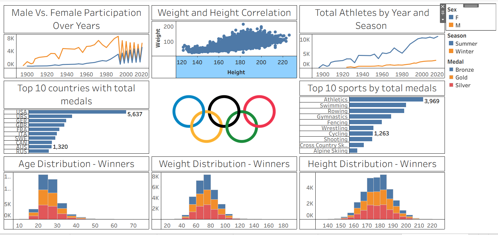

# 🏅 Olympics Data Analysis Dashboard

Interactive Tableau dashboard analyzing Olympic athlete participation, medal trends, sports performance, and demographic insights across Olympic history.

---

# 📊 Dashboard Insights

This dashboard provides analysis on:

- Male vs Female participation over years
- Athlete Height & Weight correlation
- Total athletes by year and season
- Top 10 countries by medal count
- Top 10 sports by medals
- Age distribution of winners
- Weight distribution of winners
- Height distribution of winners

---

# 📈 Key Findings

- USA leads overall medal count
- Athletics and Swimming dominate Olympic medals
- Athlete participation increased significantly over time
- Most medal winners fall within specific age and fitness ranges

---

# 🛠 Tools & Technologies

- Tableau Public
- Data Visualization
- Dashboard Design
- Analytics
- CSV Dataset

---

# 🔗 Live Dashboard

👉 [View Interactive Dashboard](https://public.tableau.com/app/profile/sonali.sagar/viz/OlympicsDashboard_17798631238050/OlympicsDashboard)

---

# 📸 Dashboard Preview

---

# 🚀 Project Objective

This project was developed to explore:
- Sports analytics
- Interactive visual storytelling
- Data-driven insights
- Tableau dashboard development

---

# 👩‍💻 Author

Sonali Sagar
